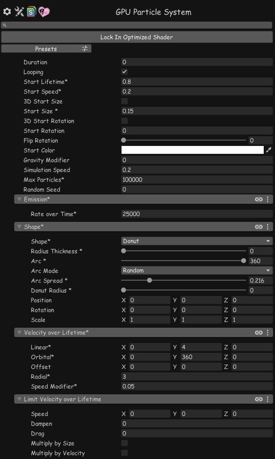
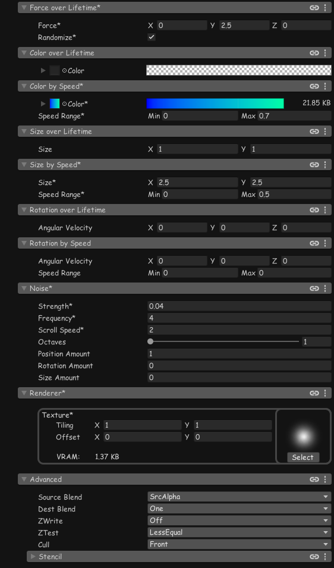

# GPU Particle System

A stateless GPU particle system shader for Unity / VRChat.

## Overview

GPUParticle recreates Unity Shuriken particle features entirely in the vertex shader, eliminating CPU overhead. Each frame recalculates particle state from deterministic seeds—no texture read/write required.

Most Shuriken modules supported. VR compatible.

|                                   |                                   |
|-----------------------------------|-----------------------------------|
|  |  |

**Limitations:**
- World Space only
- Constant values only
- Not supported: Collision, Triggers, Sub Emitters, Lights, Trails ...

## Usage

1. **Generate Mesh**
   Tools → GPU Particle System → Generate Mesh

2. **Create Material**
   Create material with `GekikaraStore/GPUParticleSystem` shader

3. **Setup GameObject**
   Add MeshFilter (generated mesh) + MeshRenderer (material) or SkinnedMeshRenderer (material)

Requires [Thry ShaderEditor](https://github.com/Thryrallo/ThryEditor) for the inspector UI.

## License

MIT License - see [LICENSE](https://github.com/aiczk/GPUParticleSystem/blob/main/LICENSE) for details.
